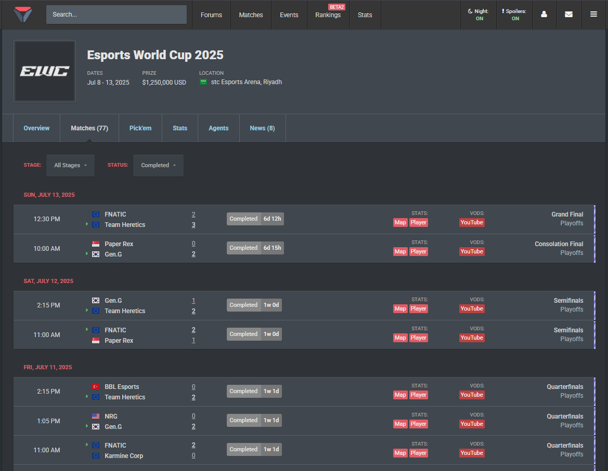

# 🎮 VLR.gg Match Data Extractor

A powerful Python scraper that extracts **individual map results** from Valorant esports matches on VLR.gg. Perfect for esports analysis, match prediction models, and tournament data collection.

## ✨ Features

- 🌐 **Event URL Extraction** - Automatically scrapes all match URLs from VLR.gg event pages
- 🗺️ **Individual Map Data** - Extracts each map result separately (not just overall match scores)
- 🖥️ **CLI Interface** - User-friendly command line interface
- 📊 **Multiple Formats** - Exports to both CSV and Excel with summary statistics
- 🏷️ **Custom Naming** - File names based on event name for organization
- 🔍 **Smart Parsing** - Robust extraction of team names, map names, scores, and winners
- ⚡ **Bo1/Bo3/Bo5 Support** - Handles different match formats automatically

## 📋 Data Extracted

Each row represents **one map** with the following information:

| Column | Description | Example |
|--------|-------------|---------|
| `tournament` | Tournament/event name | "Esports World Cup 2025" |
| `match_type` | Match stage | "Upper Quarterfinals" |
| `date` | Match date | "May 16, 2025" |
| `team_A` | First team name | "FUT Esports" |
| `team_B` | Second team name | "Apeks" |
| `map_number` | Map number in series | 1, 2, 3, etc. |
| `map_name` | Valorant map | "Ascent", "Bind", "Haven" |
| `team_A_score` | Team A rounds won | 13 |
| `team_B_score` | Team B rounds won | 7 |
| `winner` | Map winner | "FUT Esports" |
| `team_A_won` | Team A won (1/0) | 1 |
| `team_B_won` | Team B won (1/0) | 0 |
| `url` | Original match URL | VLR.gg match link |

## 🚀 Quick Start

### Prerequisites

```bash
pip install requests beautifulsoup4 pandas openpyxl
```

### Usage

1. **Run the script:**
```bash
python extract_vlr_matches.py
```

2. **Enter event details:**
```
📝 Enter event name (for file naming): EWC 2025

🌐 Event URL Options:
1. Enter VLR.gg event URL (from matches section)
2. Use pre-defined match URLs

Select option (1 or 2): 1
🔗 Enter VLR.gg event URL: https://www.vlr.gg/event/matches/2449/esports-world-cup-2025/?series_id=all&group=completed
```

3. **Get your data:**
- `{event_name}_match_maps.csv` - Raw map data
- `{event_name}_match_maps.xlsx` - Excel with summary stats

## 📖 Detailed Usage

### Option 1: Tournament/Event URL (Recommended)

**⚠️ IMPORTANT:** You must use the **matches section** URL of the tournament page, not the main event page.

✅ **Correct URL format:**
```
https://www.vlr.gg/event/matches/2449/esports-world-cup-2025/?series_id=all&group=completed
```
- Notice the `/matches/` in the URL
- This is the "Matches" tab of the tournament page
- Can include filters like `?series_id=all&group=completed`

❌ **Wrong URL format:**
```
https://www.vlr.gg/event/2449/esports-world-cup-2025/  # Main event page (won't work)
```

**How to get the correct URL:**
1. 🌐 Go to any VLR.gg tournament page (e.g., `https://vlr.gg/event/2449/esports-world-cup-2025/`)
2. 🎯 Click on the **"Matches"** tab in the navigation
3. ✅ Your URL should now look like: `https://www.vlr.gg/event/matches/2449/esports-world-cup-2025/?series_id=all&group=completed`
4. 📋 Copy this URL from your browser and paste it into the scraper

**Visual cue:** Look for the `/matches/` in your browser's address bar!



### Option 2: Pre-defined Individual Match URLs

Uses the hardcoded Esports World Cup 2025 individual match URLs for testing purposes. This option processes a specific list of match URLs included in the script.

## 🎯 Example Output

```
🎮 Processing 45 matches for event: EWC 2025
============================================================

[1/45] Processing: fut-esports-vs-apeks-esports-world-cup-2025-ubqf
  🔍 Found 3 potential map containers
  ✅ Found 3 maps:
    Map 1: Split - FUT Esports 13-6 Apeks (Winner: FUT Esports)
    Map 2: Lotus - FUT Esports 13-11 Apeks (Winner: FUT Esports)
    Map 3: Haven - FUT Esports 13-9 Apeks (Winner: FUT Esports)

✅ Successfully processed 42/45 matches
📊 Total maps extracted: 127
💾 Saved to EWC_2025_match_maps.csv
📊 Saved to EWC_2025_match_maps.xlsx
```

## 📊 Excel Output Features

The Excel file includes:
- **All Maps Sheet** - Complete map-level data
- **Summary Sheet** - Team statistics (maps played, won, win rate)

## 🔧 Customization

### Adding New Map Names

Update the `valorant_maps` list in `extract_maps_alternative_method()`:

```python
valorant_maps = [
    'Ascent', 'Bind', 'Haven', 'Split', 'Icebox', 'Breeze',
    'Fracture', 'Pearl', 'Lotus', 'Sunset', 'Abyss'
    # Add new maps here
]
```

### Adjusting Request Delays

Modify the delay between requests in `main()`:

```python
time.sleep(2)  # Change to your preferred delay (seconds)
```

## ⚠️ Important Notes

### URL Requirements
- **Must use matches section URL:** `https://www.vlr.gg/event/matches/[ID]/[tournament-name]/`
- **Not the main event page:** `https://www.vlr.gg/event/[ID]/[tournament-name]/`
- Look for `/matches/` in the URL path

### Rate Limiting
The scraper includes a 2-second delay between requests to be respectful to VLR.gg servers. **Do not remove or reduce this delay** to avoid being blocked.

## 🐛 Troubleshooting

### Common Issues

1. **No maps found:**
   - Check if the match has completed
   - Verify the VLR.gg URL is correct
   - Some matches may have different page structures

2. **Missing map names:**
   - The script includes fallback parsing methods
   - Map names are extracted from multiple sources

3. **Connection errors:**
   - Check internet connection
   - VLR.gg may be temporarily unavailable

### Debug Mode

For troubleshooting, look for console output:
```
🔍 Found 3 potential map containers
🔄 Trying alternative parsing method...
📍 Found Ascent: 13-7
```

## 📁 Project Structure

```
vlr.gg_scraper/
├── extract_vlr_matches.py    # Main scraper script
├── README.md                 # This file
├── requirements.txt          # Python dependencies
└── output/                   # Generated CSV/Excel files
    ├── EWC_2025_match_maps.csv
    └── EWC_2025_match_maps.xlsx
```

## 🤝 Contributing

1. Fork the repository
2. Create a feature branch (`git checkout -b feature/new-feature`)
3. Commit changes (`git commit -am 'Add new feature'`)
4. Push to branch (`git push origin feature/new-feature`)
5. Create a Pull Request

## ⚖️ Legal & Ethics

- **Respect robots.txt** and VLR.gg's terms of service
- **Rate limiting** is implemented to avoid server overload
- **For educational/research purposes** - respect data usage policies
- **No commercial use** without proper permissions

## 📜 License

This project is licensed under the MIT License - see the [LICENSE](LICENSE) file for details.

## 🙏 Acknowledgments

- [VLR.gg](https://vlr.gg) for providing comprehensive Valorant esports data
- Built for the Valorant esports community and data analysts

---

**⭐ Star this repo if it helps your esports analysis!** 